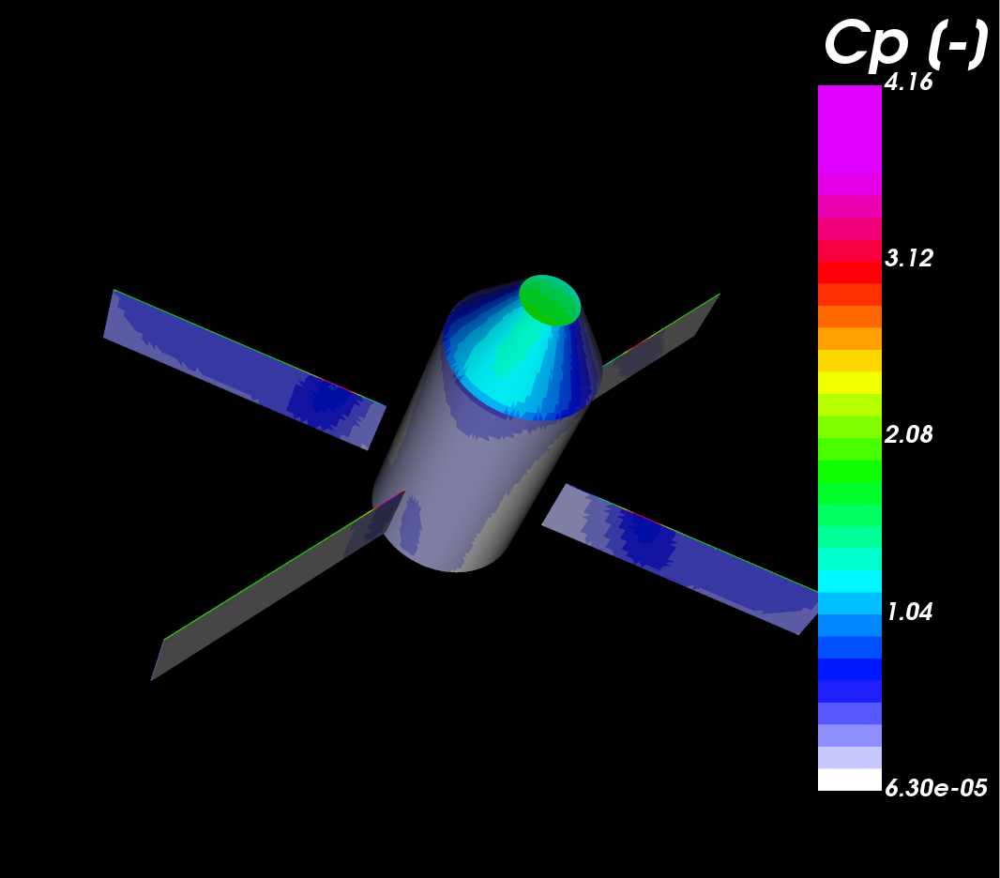

# Aggregate
Python post processing aerodynamic tool based on vtk and pandas that: 
* Derive (integrate) aerodynamic coefficients from triangular surfaces input(s) 
* Transform data 
* Probe the closest data points 

## Table of contents
* [TODO](#todo)
* [Exemples](#exemples)
   * [Integrate](#integrate)
   * [Concatenate files](#concatenate-files)
   * [Visualize data](#visualize-data)
   * [Transform data](#transform-data)
   * [Complete exemple](#complete-exemple)
* [Usage](#usage)
* [Dependancies](#dependancies)


## TODO
 - Implement and test "reverse_aero_convention". Only alpha=beta=0 has been tested
 - Add test 
 - Finish readme and documentation (data extraction using a serie of point) 
 - fix (reverse)-noAutoOrient
## Exemples

### Integrate
Input used in command line: 
- 5 files 
- variables used for integration. Some defaut values are omitted, [see Usage for detail](#usage) 

```
python3 Aggregate/core.py -i data/xcore-F1000-0.vtk -Cp "Cp [-]"  -Cfx "Cfx [-]" -Cfy "Cfy [-]" -Cfz "Cfz [-]"  -q "Heat Flux: Net [W/m2]"  
```

Output:
 - xls file one file containing the concatenated data 
 - one file containing the concatenated data 
```
...
write integration data in : output.csv
plot in : output.png
```


### Concatenate files
Data get concatenated only if the same data exist in each file. If not no data is included 
```
python3 Aggregate/core.py -i  data/xcore-F1000-0.vtk data/xpanel*  
```
```
...
concatenate the inputs...
writting: output.vtk
```
### Visualize data
Read files, concatenate them and visualize the results in an interactive windows.

#### exemple without specified the variable to be displayed 
```
python3 Aggregate/core.py -i  data/xcore-F1000-0.vtk data/xpanel*  -gl 
```
#### exemple selectioning the variable to display (auto-scaling)  
```
python3 Aggregate/core.py -i  data/xcore-F1000-0.vtk data/xpanel*  -gl  -glvar "Cp [-]" 
```

The output.vtk file can also be viewed using Paravie <url>www.paraview.org</url>
#### output
```
Available data
                BC [-]
                Cf [-]
                Cfx [-]
                Cfy [-]
                Cfz [-]
   SELECTED ->  Cp [-]
                Cq: Net [-]
                Normals
                Pressure [Pa]

```



### Transform data
Read files, translate and/or rotate and/or scale them. Translation (-t) is applied first, then matrix transformation (-r) , then rotation around x (-rx)  , then rotation around y (-ry)  , then rotation around z (-rz) 

#### translation of [0 , 7 , 2 ]
```
python3 Aggregate/core.py -i  data/xcore-F1000-0.vtk data/xpanel*  -t 0 7 2 
```

#### mirror with respect to Y, scaling of 2 in the x direction 
```
python3 Aggregate/core.py -i  data/xcore-F1000-0.vtk data/xpanel*  -r 2 0 0 0 -1 0 0 0 1 
```
```
Apply : X = R * X with 
    [2.0, 0.0 0.0]
R = [0.0, -1.0 0.0]
    [0.0, 0.0 1.0]

```

#### rotation of 50 [deg] around oX 
```
python3 Aggregate/core.py -i  data/xcore-F1000-0.vtk data/xpanel*  -rx 50 
```

  
### Complete exemple 
TODO

### Data extraction 
Using a serie of 3D points as input, recover the data that is the closest for each point
TODO


## Usage

```
usage: core.py [-h] -i LIST_INPUT [LIST_INPUT ...] [-f FORCEFORMAT]
               [-o OUTPUTNAME]
               [-k LIST_VARIABLETOKEEPFORWRITING [LIST_VARIABLETOKEEPFORWRITING ...]]
               [-Cp CP] [-Cfx CFX] [-Cfy CFY] [-Cfz CFZ] [-q Q] [-qd QD]
               [-alpha ALPHA_DEG] [-beta BETA_DEG] [-cog xcog ycog zcog]
               [-Sref SREF] [-Lref LREF] [-reverse_normal]
               [-reverse_aero_convention] [-autoOrient] [-t tx ty tz]
               [-r r11 r12 r13 r21 r22 r23 r31 r32 r33] [-rx RX] [-ry RY]
               [-rz RZ] [-nw] [-glvar VARIABLETODISPLAY] [-gl]
               [-e EXTRACTFROMCVS] [-v]
```

| Arguments | Description | Default value | Purpose|
| --- | --- | --- | ---| 
| -i | List of input files. Required|  |  |
| -Cp | Variable defining the pressure coefficient | | integration |
| -Cfx| Variable defining the frictions coefficient in the x-direction | | integration |
| -Cfy| Variable defining the fictions coefficient in the y-direction | | integration |
| -Cfz| Variable defining the frictions coefficient in the z-direction | | integration |
| -q  | Variable (unit_q per unit of surface) to integrate, eg [W/m2]  | | integration |
| -Lref | Length of reference used to scale the moment: (Cm,Cl,Cn)  | 1 | integration |
| -Sref | Surface of reference used to scale all the coefficents:\n Cx, Cy, Cz, Cm,Cl,Cn, ...  | 1 | integration |
| -alpha | Angle of attack [deg] | 0 | integration |
| -beta | Angle of side-slip [deg]| 0 | integration |
| -cog | Coordinate of the center of gravity used to compute the moment | 0. ,0. ,0.  | integration |
| -noAutoOrient| Do not auto orient the surface of the triangle for every single input file individually (vtk AutoOrientNormalsOn) | disable | integration |
| -reverse_normal | Reverse the orientation of the normals | disable | integration |
| -o | Base name of the output file: .csv, .xls, .vtk, .png | output | data manipulation |
| -k | List of variable to keep in the output |  | data manipulation |
| -t | Translation vector: tx, ty, tz | 0., 0., 0.  | data manipulation |
| -r | Transformation Matrix R = [[r11 r12 r13][r21 r22 r23][r31 r32 r33]] | 1., 0., 0., 0., 1., 0., 0., 0., 1. | data manipulation |
| -rx | Rotate around ox with angle rx [deg] | 0. | data manipulation |
| -ry | Rotate around oy with angle ry [deg] | 0. | data manipulation |
| -rz | Rotate around oz with angle rz [deg] | 0. | data manipulation |
| -gl | Display data | disable  | visualization |
| -glvar | Variable to display |   | visualization |
| -e | path to csv file where (x,y,z) coordinate are defined |   | data probing |


## Dependancies

```
pip3 install -r requirements.txt
```
